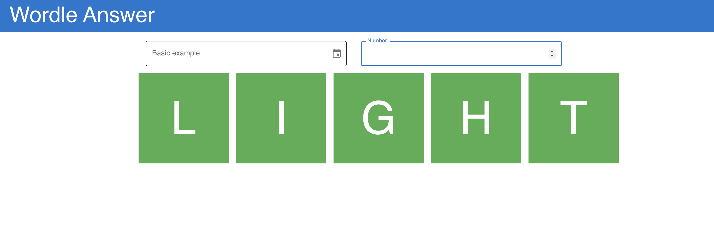

## Usage

## 1. Run as Java server
```
1. Run `cd wordle-server`
2. Package into jar: `mvn clean package`
3. Create server: `java -jar target/wordle-answer-1.0-SNAPSHOT.jar`
4. Perform GET request on the path `localhost:7070/wordle/v2?ts=<timestamp>&slNum=<wordleDay>`
```

### Example

`curl --location --request GET 'localhost:7070/wordle/v2?ts=1643632424&slNum=0'`

### Output

`light`

## 2. Run as React app
```
1. Run `cd wordle-webapp`
2. Run `npm run dev`
3. Open http://localhost:3000
```



